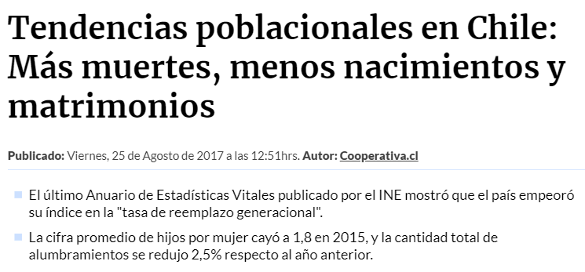
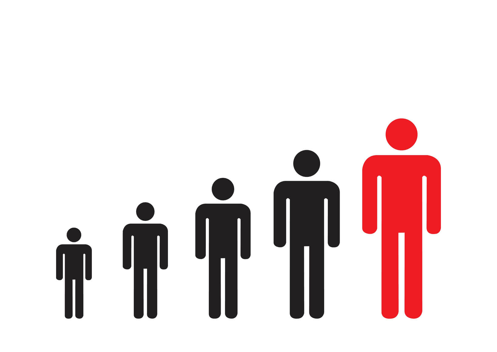
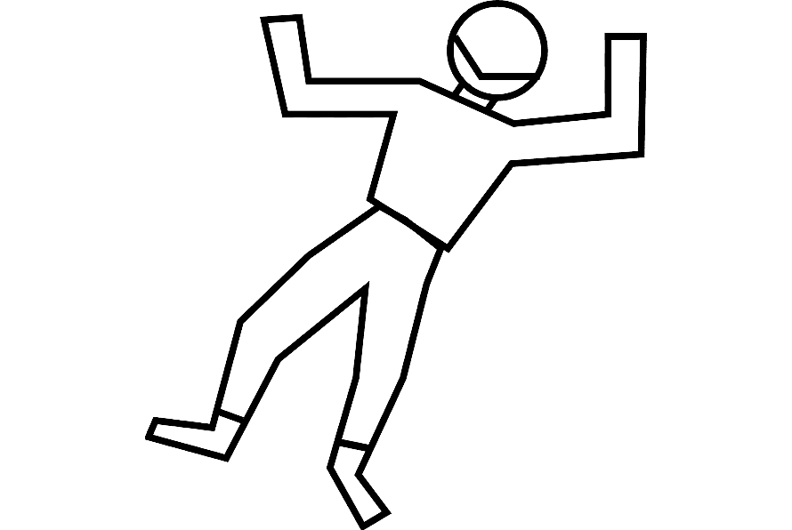
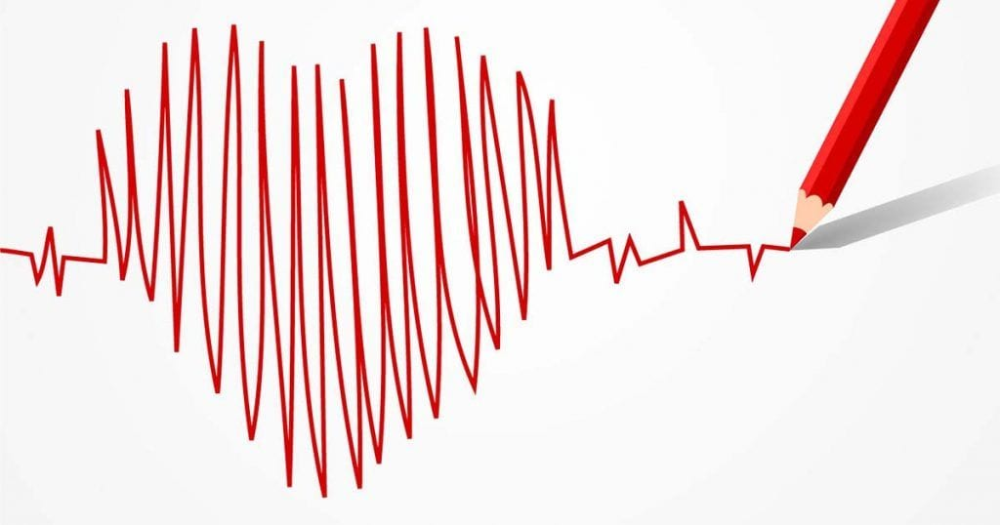

```{r setup, include=FALSE}
options(htmltools.dir.version = FALSE)
knitr::opts_chunk$set(dev = 'svg', warning = FALSE, echo = FALSE, fig.align = "center", fig.width = 11, fig.height = 8, message = FALSE)
options(device = function(file, width, height) {
  svg(tempfile(), width = width, height = height)
})
library(tidyverse)
library(stevemisc)
require(DT)
library(gganimate)
require(ggiraph)
require(plotly)

load(here::here("codigo", "exploraciones", "environment", "environment.RData"))
```

class: center, middle



 
---


class: center, middle

# Introducción

---
class: center, middle

#### Registro obligatorio de defunciones en Chile desde 1990


---
class: center, middle

#### Tasa de Mortalidad



---
class: center, middle

#### Alta Tasa de Mortalidad



---
class: center, middle

#### Objetivo del Análisis


---
# ¿Qué veremos?

<br>

- Información de defunciones a nivel nacional


--

- Información de defunciones según región


--

- Causas de defunciones en las comunas con alta tasa de mortalidad


--

- Conclusiones

---
class: center, middle

# Información de defunciones a nivel nacional

---
class: center, middle

```{r}
defunciones_por_region %>% 
    datatable(class = "cell-border stripe") %>% 
    formatStyle('Tasa Mortalidad', target = 'row', backgroundColor = styleEqual(c(606), c('#F9B8AA')), columns = colnames(.), fontSize = '80%')
```

---

class: center, middle

#### Región de la Araucanía

---
class: center, middle

```{r}
ggplotly(regiones[[9]]$grafico_compl) %>%
  highlight(
    "plotly_hover",
    selected = attrs_selected(line = list(color = "black"))
)
```

---
class: center, middle

```{r}
regiones[[9]]$grafico_quant
```

---
class: center, middle

```{r}
regiones[[9]]$comunas_region %>% knitr::kable(., "html")
```

<center>
<p>Tabla 2: Tasa de Mortalidad en las comunas destacadas de la región</p>
</center>

---
class: center, middle

# Causas de defunciones en las comunas con alta tasa de mortalidad

---
class: center, middle

```{r}
defunciones_comuna %>%
    knitr::kable(., "html")
```

<center>
<p>Tabla 3: Comunas con mayor tasa de defunciones a nivel país</p>
</center>

---
class: center, middle

#### Galvarino

---
class: center, middle

```{r}
galvarino %>% 
    knitr::kable(., "html")
```

<center>
<p>
Tabla 4: Tipos de enfermedades que conllevaron a defunciones en la comuna
</p>
</center>

---
class: center, middle

```{r}
detalle_galvarino %>% knitr::kable(., "html")
```

<center>
<p>
Tabla 5: Enfermedades que conllevaron a defunciones en la comuna
</p>
</center>

---
class: center, middle

#### Ercilla

---
class: center, middle

```{r}
ercilla %>% 
    knitr::kable(., "html")
```

<center>
<p>
Tabla 6: Tipos de enfermedades que conllevaron a defunciones en la comuna
</p>
</center>

---
class: center, middle

```{r}
detalle_ercilla %>% knitr::kable(., "html")
```

<center>
<p>
Tabla 7: Enfermedades que conllevaron a defunciones en la comuna
</p>
</center>

---
class: center, middle

# Conclusiones

---
class: center, middle

#### Regiones con mayor tasa de mortalidad

---
class: center, middle

#### Patrones dentro de cada región

---
class: center, middle

#### Tipos de enfermedades que afectan a las comunas en cuestión

---
class: center, middle

#### Enfermedades que afectan a las comunas estudiadas

---
class: center, middle

#### ¿Qué sigue ahora?




---
class: center, middle

# ¡Muchas Gracias!

<span style='font-size:100px;'>&#128512;</span>

.footnote[
  Contacto: <errucan@uc.cl>
]


